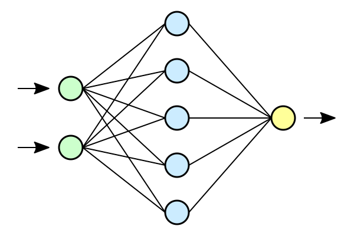

 Holberton Machine learning 

Projects and concepts for Machine learning use and mastery

## Author
Michael George - [linkedin](https://www.linkedin.com/in/mageorge/) [github](https://github.com/mag389)

I am a Cornell Grad and Current Holberton student studying Machine Learning. Particularly interested in predictive analytics and data science.

## Extra Sources:
These sources cover big topics and dpeendencies that are used in all sub folders

https://medium.com/analytics-vidhya/2d-convolution-using-python-numpy-43442ff5f381

https://github.com/Machinelearninguru/Image-Processing-Computer-Vision/blob/master/Convolutional%20Neural%20Network/Convolutional%20Layers/README.md

https://github.com/Machinelearninguru/Image-Processing-Computer-Vision/blob/master/Convolutional%20Neural%20Network/Convolutional%20Layers/README.md

https://www.deeplearningbook.org/

https://d2l.ai/chapter_recurrent-modern/bi-rnn.html
